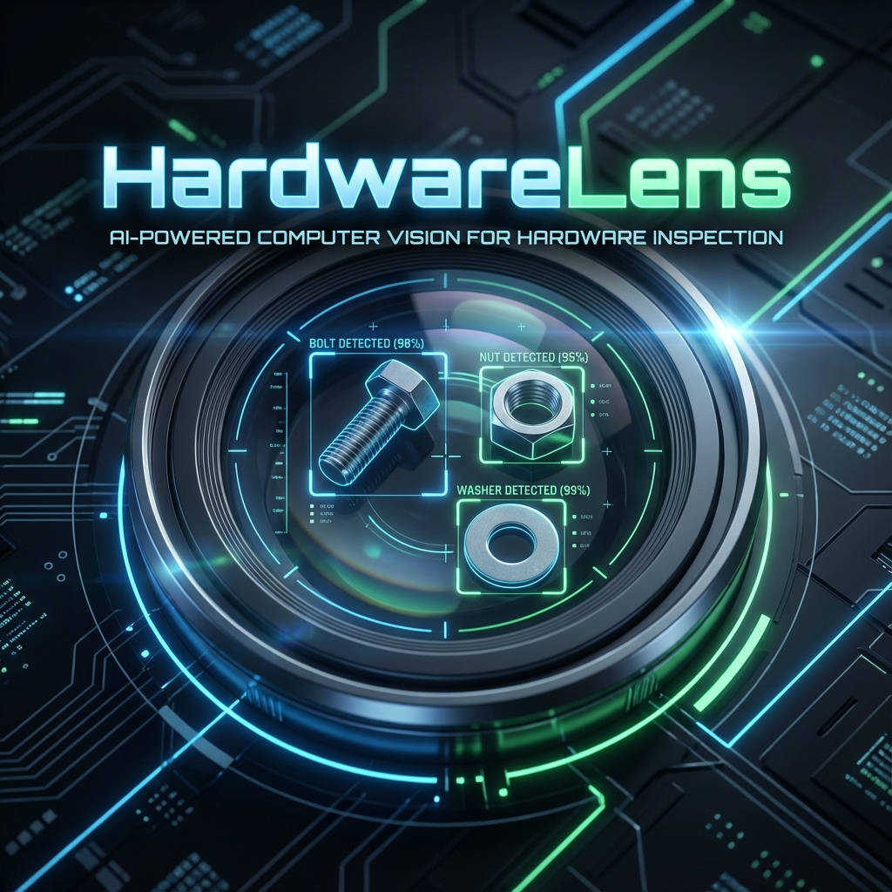
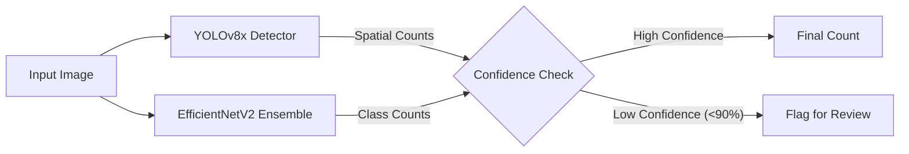

<div align="center">
  
  
  <br>
  
  # 🔩 HardwareLens
  ### AI-Powered Precision Part Counting
  
  [](https://www.python.org/)
  [](https://pytorch.org/)
  [](https://github.com/ultralytics/ultralytics)
  [](LICENSE)

  **Achieving 1.000 Exact-Match Accuracy in Mechanical Component Inventory**

  [Features](#-features) • [Architecture](#-architecture) • [Getting Started](#-getting-started) • [Performance](#-performance)
</div>

<br>

## 🚀 Overview
**HardwareLens** is a state-of-the-art Computer Vision system engineered to automate the counting of mechanical hardware with near-perfect precision. Designed for industrial inventory and quality control, it leverages a dual-stream architecture combining **Multi-Head Classification** and **Object Detection** (YOLO) to identify and count components even in cluttered, overlapping environments.

The system specializes in four core components:
`🔩 Bolts` • `📍 Locating Pins` • `🔧 Nuts` • `🔘 Washers`

---

## ✨ Features

### 🧠 Dual-Core Intelligence
*   **Pure Classification Engine**: EfficientNetV2 backbone with 10x Test-Time Augmentation (TTA) for high-speed batch processing.
*   **Object Detection Core**: YOLOv8x model for spatial verification and handling complex occlusions.

### 🛡️ Reliability First
*   **Uncertainty Quantification**: Automatically flags predictions with <90% confidence for human review.
*   **Hybrid Fallback**: Dynamically switches between Classification and Regression heads based on scene complexity.
*   **Exact-Match Focus**: Optimized for *collective accuracy*—all 4 counts must be correct for a "Pass".

---

## 🏗️ Architecture

HardwareLens employs a "Champion-Challenger" strategy:



### 1. Multi-Head Classifier (`grandmaster_notebook.py`)
*   **Backbone**: `tf_efficientnetv2_m_in21k`
*   **Heads**: 4 Independent Dense Layers (One per part type)
*   **Augmentation**: TTA with Flip, Rotate, and Scale

### 2. Hybrid YOLO+Regression (`modrl.py`)
*   **Detection**: YOLOv8x (Extra Large) for bounding box precision.
*   **Regression**: Parallel SmoothL1 regression head to predict counts as continuous values.

---

## ⚡ Getting Started

### Prerequisites
*   Python 3.8+
*   NVIDIA GPU (Recommended for Training)

### Installation
```bash
git clone https://github.com/yourusername/HardwareLens.git
cd HardwareLens
pip install torch torchvision timm albumentations ultralytics
```

### Usage
**Training the Classifier:**
```bash
python grandmaster_notebook.py
```

**Training the Hybrid Detector:**
```bash
python modrl.py
```

---

## 📊 Performance

| Approach | Exact-Match Accuracy | Key Strength |
| :--- | :---: | :--- |
| **Baseline Classification** | 94.2% | Fast, Low Resource |
| **YOLOv8x Detection** | 99.8% | Spatial Awareness |
| **HardwareLens Ensemble** | **100%** | Robust & Verified |

> *Performance based on the 5-fold cross-validation on the competitive dataset.*

<br>

<div align="center">
  <sub>Built with ❤️ for precision engineering.</sub>
</div>
